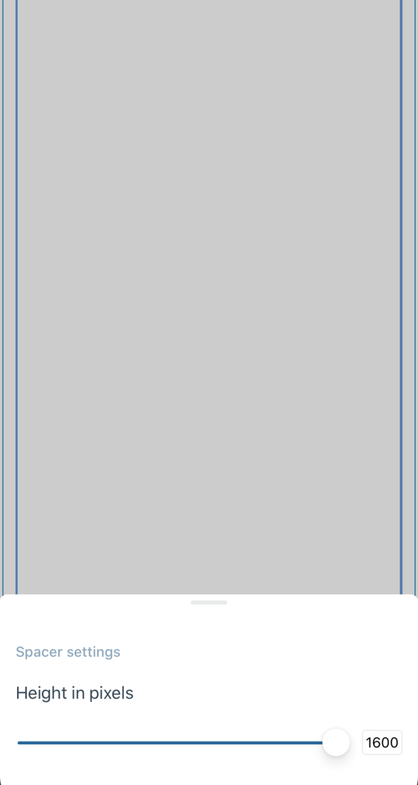

# Spacer Block - Test Cases

--------------------------------------------------------------------------------

##### TC001

### Adjusting spacer height with slider

-   Add a `Spacer` block
-   Check if `Spacer` block is rendered with default value of `100px`
-   Change slider value under `Spacer` settings and measure if `Spacer` block has height setted via slider

Expected look:  

--------------------------------------------------------------------------------

##### TC002

### Check range of values

-   Add a `Spacer` block
-   Check if minimum `Spacer` height to set via `Slider` in settings equals `20px`
-   Check if maximum `Spacer` height to set via `Slider` in settings equals `500px`

Expected look:  

--------------------------------------------------------------------------------

##### TC003

### Check if posiible to set height range extends when setted value on web is more that 500px

-   Add a `Spacer` block via web version
-   Set `Spacer` height to more that `500px` and save the post
-   Open mobile app and check if `Spacer` block is rendered with setted height
-   Check if slider value is the same as setted on web and the `Slider` is in the middle of the scale
-   The max value should be double like setted on web
-   The min value should be unchanged ane equals `20px`

Expected look:  

--------------------------------------------------------------------------------

##### TC004

### Check behaviour in vertical and horizontal

-   Add a `Spacer` block
-   Check if app do not crash when open settings
-   Check if `Spacer` has proper height after rtotate the device
-   Check previous test cases in horizontal layout

--------------------------------------------------------------------------------
